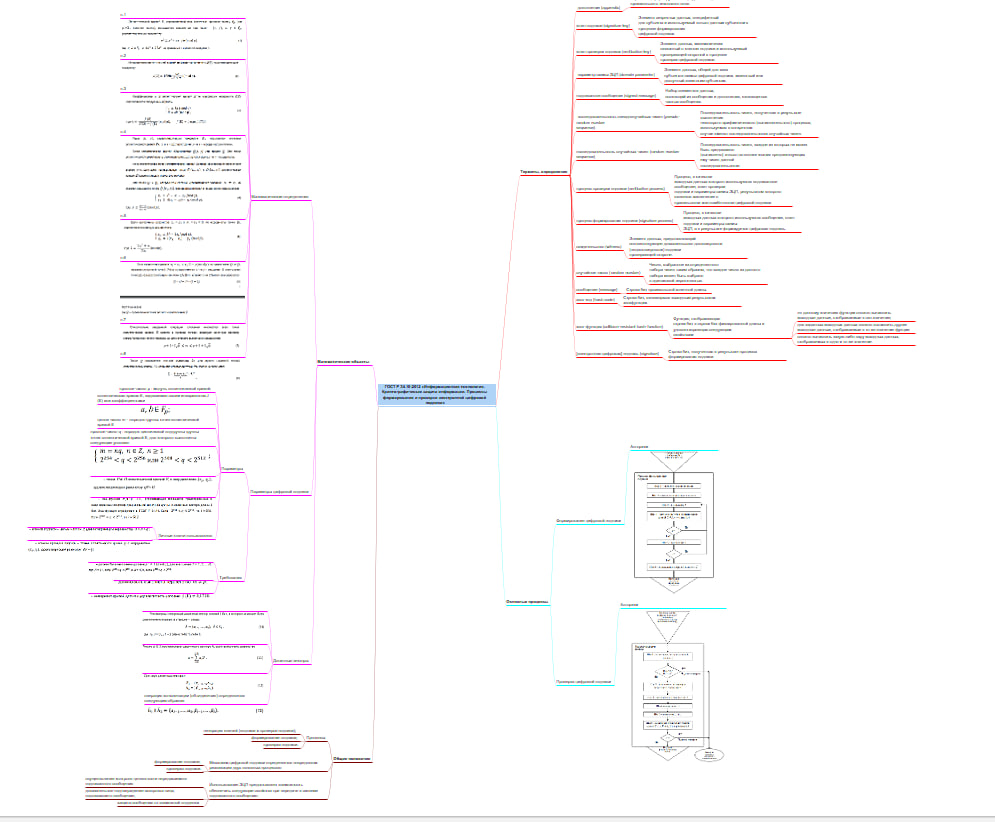

Создание mind-map
================
Рудзик А.Р.

## Цель работы

1.  Выбрать и ознакомиться с российским стандартом из сферы
    информационной безопасности

2.  Получить навыки систематизации информации с помощью интеллект карты

## Ход выполнения практической работы

Был найден стандарт ГОСТ Р 34.10-2012 «Информационная технология.
Криптографическая защита информации. Процессы формирования и проверки
электронной цифровой подписи».

При помощи программного обеспечения Freeplane была создана интеллект
карта для систематизации и визуализации данного стандарта

## Оценка результата

В ходе выполнения практической работы была создана интеллект карта по
стандарту ГОСТ Р 34.10-2012 «Информационная технология.
Криптографическая защита информации. Процессы формирования и проверки
электронной цифровой подписи».

## Выводы

Таким образом, с помощью интеллект карты удалось систематизировать
информацию о стандарте в удобном для чтения виде.
